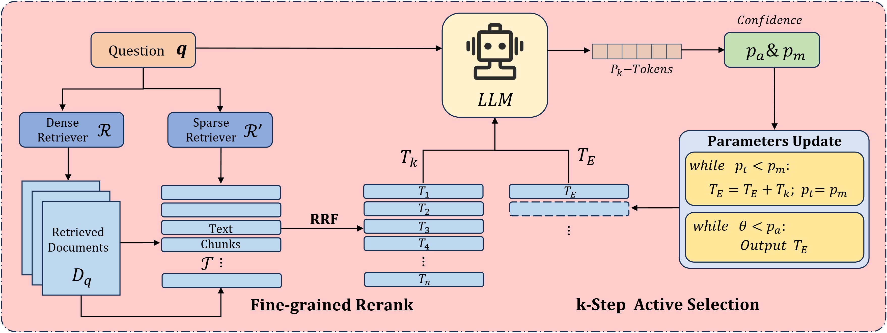

# Probability Accumulation Retrieval-Augmented Generation with Active Selection

This repository is the implement for the paper Probability Accumulation Retrieval-Augmented Generation with
 Active Selection.

## Overview

Probability Accumulation Retrieval Augmentation (PARA). It emphasizes the reliable reintegration and utilization of retrieved information to enhance inferences of LLMs. Specifically, an information selection model, driven by LLMs' reasoning confidence, is proposed to replace the traditional retrieval-augmentation process. This enables the LLMs to actively select the most relevant retrieval results, thereby ensuring the quality of the retrieved content.

<p align="center">
  
</p>

## Install environment
The code of PARA is implemented by RAGLAB. Please refer to the [RAGLAB repository](https://github.com/fate-ubw/RAGLab) for the complete conda environment configuration and retriever setting.


### Download Wikipedia knowledge database
Download the Wikipedia-23 base follow [the Document](https://github.com/fate-ubw/RAGLAB/blob/main/docs/process_wiki.md), and the first colbert processes embeddings may takes a long time.

### Setup Wikipedia search
Set up the colbert retriever using the following command:
```shell
cd RAGLAB
sh run/colbert_server/colbert_server_2023.sh
```

### Models
```shell
cd PARA
mkdir model
cd model
mkdir output_models
# retriever model
mkdir colbertv2.0
huggingface-cli download colbert-ir/colbertv2.0 --local-dir colbertv2.0/ --local-dir-use-symlinks False

# llama3 generator
mkdir Llama3-8B-baseline
huggingface-cli download RAGLAB/Llama3-8B-baseline --local-dir Llama3-8B-baseline/ --local-dir-use-symlinks False
```

### Run PARA
Use the following command to run PARA with `dataset`. 
```shell
sh ./run/rag_inference/para/para-dataset-Llama3-baseline.sh 
```